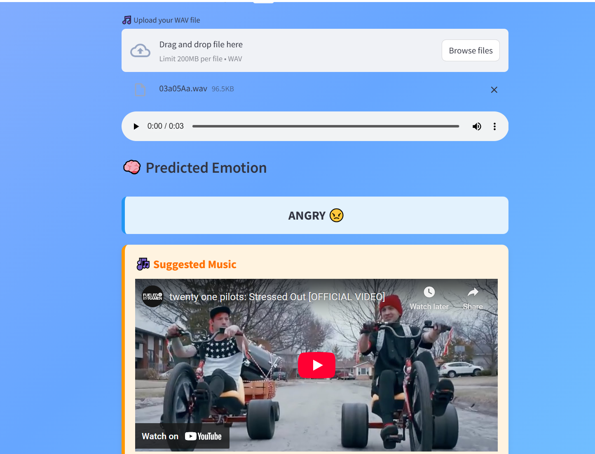

## Emotion Recognition from Speech 🎙️🔊

This project focuses on detecting human emotions from speech using Deep Learning techniques. By extracting MFCC (Mel-Frequency Cepstral Coefficients) features from audio signals and training models like CNN, RNN, and LSTM, the system classifies speech into different emotional states (e.g., happy, sad, angry, neutral, etc.).

## ✨ Key Features

Preprocessing of audio data using Librosa for feature extraction (MFCCs, Chroma, Mel Spectrograms).

Implementation of CNN/Conv2D-based models for improved feature learning.

Support for multiple emotional classes using the RAVDESS dataset.

Achieved robust accuracy by experimenting with different deep learning architectures.

Can be extended to real-time emotion recognition for human-computer interaction.

## 🛠️ Tech Stack

Languages: Python

Libraries/Frameworks: TensorFlow/Keras, Librosa, NumPy, Matplotlib, Scikit-learn

Dataset: RAVDESS Emotional Speech Dataset

## 🚀 Applications

Virtual assistants with emotional intelligence

Mental health monitoring systems

Customer service call analysis

Human-computer interaction and gaming
